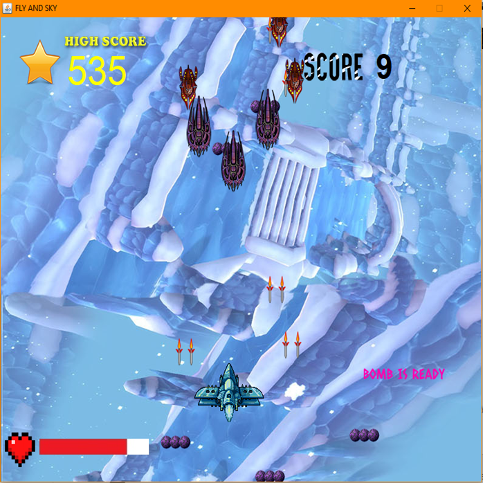
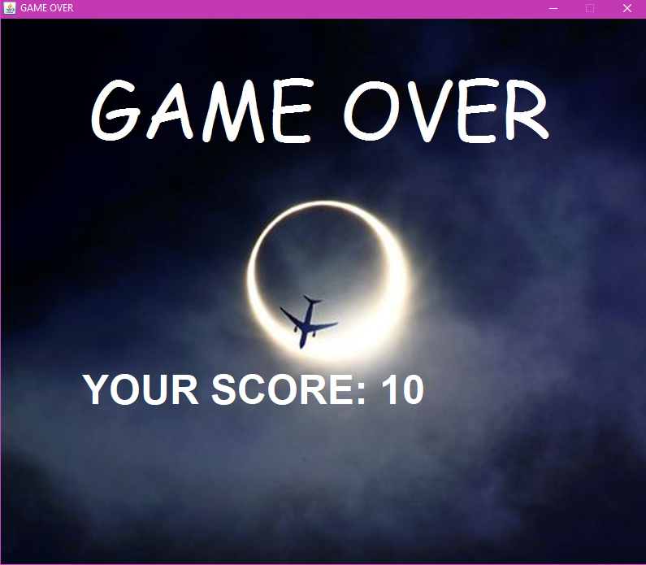

# JetFighterGame
It was aimed to make a single player Jet Fighter game similar to 1990s arcade game Raiden Fighters 2 in this project. Java programming language and the object-oriented programming concepts (encapsulation, abstraction, inheritance, polymorphism etc.) were used in this project. In addition, the project runs on multiple threads (e.g. background and gameplay run as separate threads).
<h5> Special thanks to the owners of the images for the backgrounds, items and the sounds used in this project. </h5>

## Welcome Page

## Screenshots from the Gameplay

  

## Boss 1

## Boss 2

## Game Over Page

